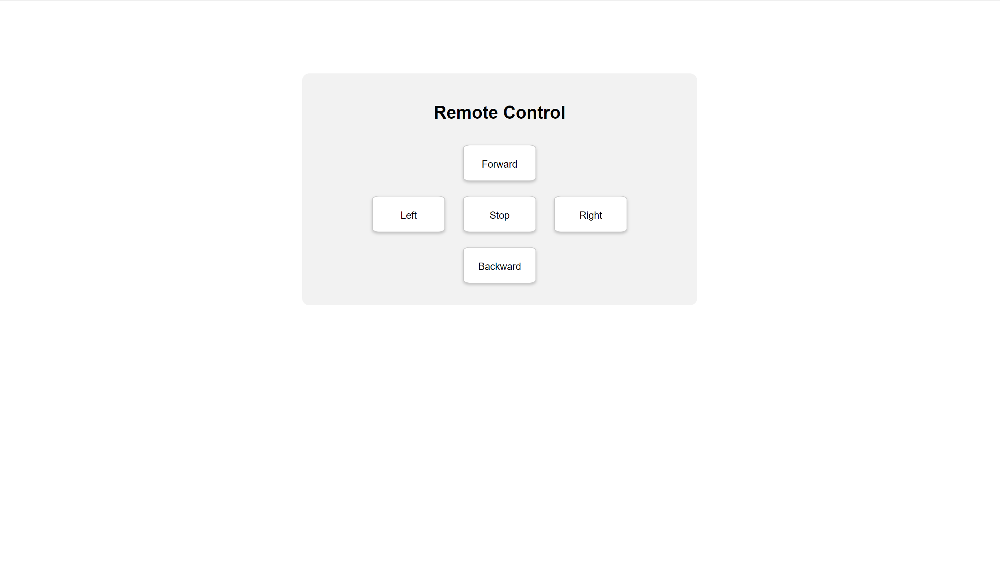
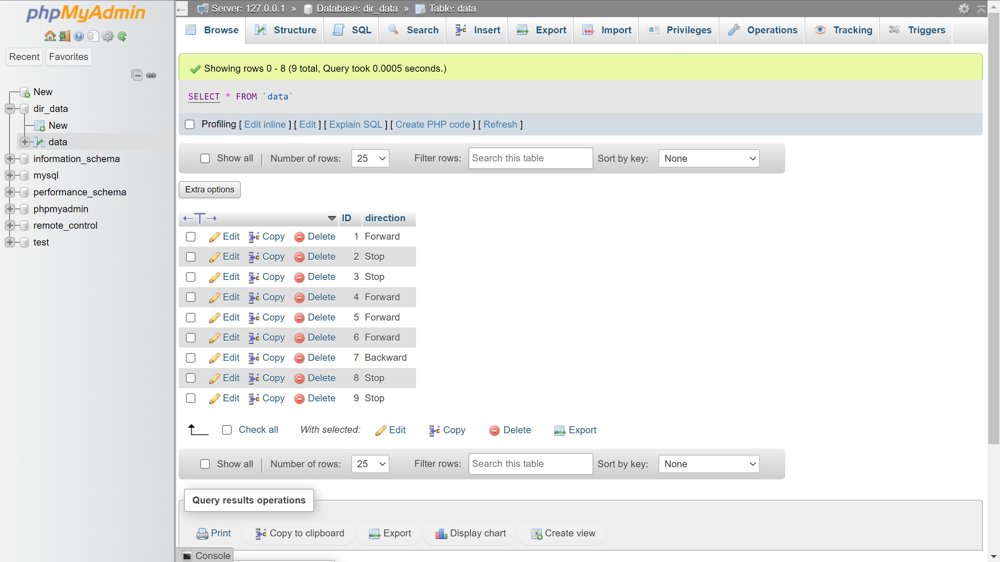

# Remote Control
Remote Control codes contains inserting a direction to the database and retrieving the last direction entered by the user.

## Remote Control Page

The remote control is in the middle of the page and contains the directions of the robot. If the user clicks Left the robot will go to left by reading the retrieve.php file.

## RemoteControl.php
In this file, the layout and design of the controller page are defined. Also, the code inserts the direction button pressed by the user to a table named data in the database. As shown in the picture below:

## retrieve.php
This code prints the last direction inserted into the table for the robot to read and do it.

## Note: 
All the functions in the codes have explaining comments for you to understand easily.
